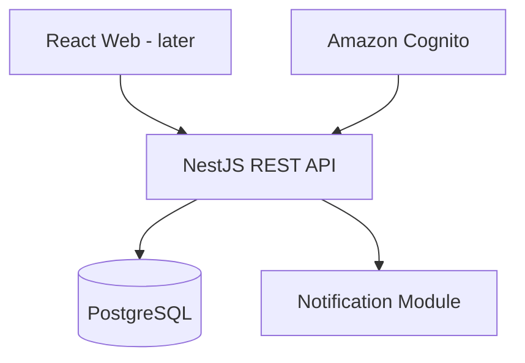
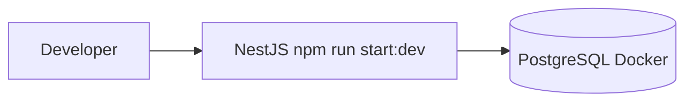
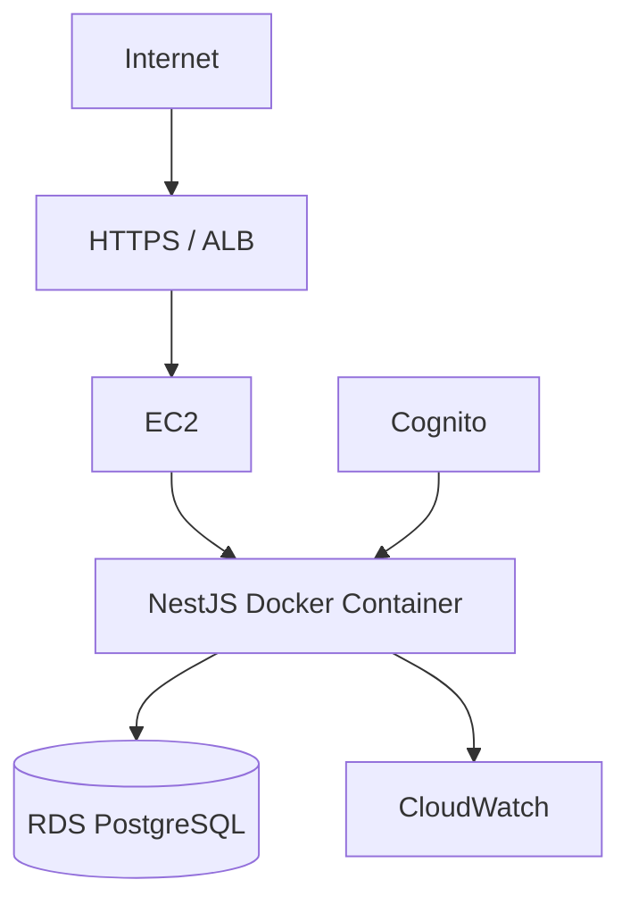

# 04 — System Architecture

## Architectural style

MediFlow V1 is a **NestJS modular monolith**.

There is:

- one backend repository
- one backend deployment artifact
- one NestJS application
- one PostgreSQL database
- multiple internal business modules

## High-level view



## Local development



## Initial production



## Why modular monolith

This is intentionally preferred over microservices because V1 has:

- one product
- closely related business workflows
- shared transactions
- a small engineering surface
- no independently scaling component requirement
- no independent team ownership requirement

## Deployment evolution

Only evolve after measurement.

Possible path:

1. single EC2 app instance + RDS
2. ALB + Auto Scaling Group with multiple identical app instances
3. ECS/Fargate if container operations justify it
4. extract a module into a service only when deployment/scaling/ownership/reliability needs justify it
5. Kubernetes/EKS only if there is a concrete platform requirement

## Data architecture

One PostgreSQL database.

Modules own logical tables but can participate in same-database transactions through application services.

Do not create a database per module.

## HTTP architecture

All external behavior is REST under:

`/v1`

Recommended global NestJS capabilities:

- ValidationPipe
- global exception filter
- request/correlation ID middleware or interceptor
- authentication guard
- roles guard
- structured logging interceptor

## Transaction boundaries

Use transactions for operations such as:

- clinic + first admin creation
- appointment booking where multiple writes are involved
- appointment rescheduling
- other operations where partial persistence would be incorrect

Do not wrap simple read-only operations in transactions.

## Notification model

V1 notification flow:

```text
AppointmentService
    |
    | commit appointment
    v
NotificationService
```

Notification errors are caught/logged after the core appointment transaction succeeds.

Future ADR may introduce SQS or another queue if reliability/volume requires it.
