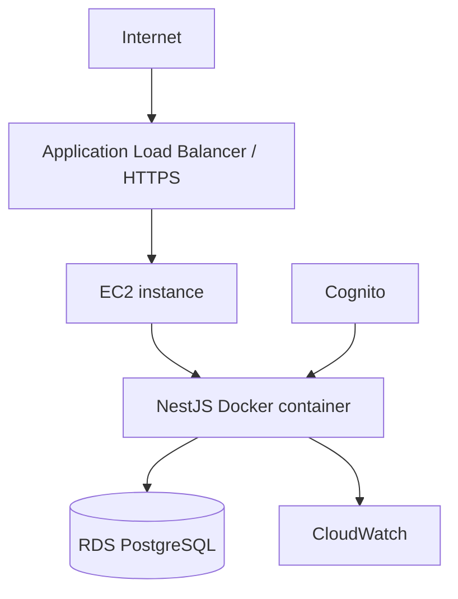

# 11 — Initial AWS Deployment

## Goal

Simple, production-appropriate deployment without Kubernetes.

## Initial topology

## Network

Recommended V1 network:

- VPC
- public subnets for ALB
- EC2 placement chosen to avoid unnecessary NAT Gateway cost
- private DB subnets for RDS
- RDS not publicly accessible
- RDS security group accepts PostgreSQL only from app security group
- app inbound accepts application traffic only from ALB security group
- SSH should not be broadly exposed; prefer SSM Session Manager when configured

The exact subnet/EC2 egress design should be confirmed in Terraform planning to avoid hidden NAT costs.

## Compute

Initial:

- one EC2 instance
- Docker
- NestJS container

Later, if required:

- Auto Scaling Group
- multiple app instances
- ECS/Fargate

Do not start with Kubernetes/EKS.

## Database

Amazon RDS PostgreSQL.

Production settings should include:

- automated backups
- deletion protection where appropriate
- encryption at rest
- private networking
- monitoring
- maintenance window
- sensible retention

Start with development-sized capacity; scale based on metrics.

## Docker image

Production Dockerfile should use multi-stage build.

Runtime image should contain only what is required to run the compiled app.

Run the process as a non-root user where practical.

## Configuration

Do not put secrets in the image.

Production configuration comes from secure runtime configuration.

## CI/CD

GitHub Actions:

1. install dependencies
2. typecheck
3. lint
4. unit tests
5. integration/E2E where configured
6. build Docker image
7. publish image to chosen registry
8. deploy using AWS OIDC-authenticated workflow

No long-lived AWS access keys in GitHub.

Production deployment should include an explicit approval gate when practical.

## Database migrations in deployment

Migrations must run once per deployment through a controlled step.

Do not rely on every app instance racing to run migrations at startup.

## Rollback

Application rollback:

- retain previous known-good image tag

Database rollback:

- prefer forward-fix migrations for production incidents
- destructive down migrations require care and explicit approval
